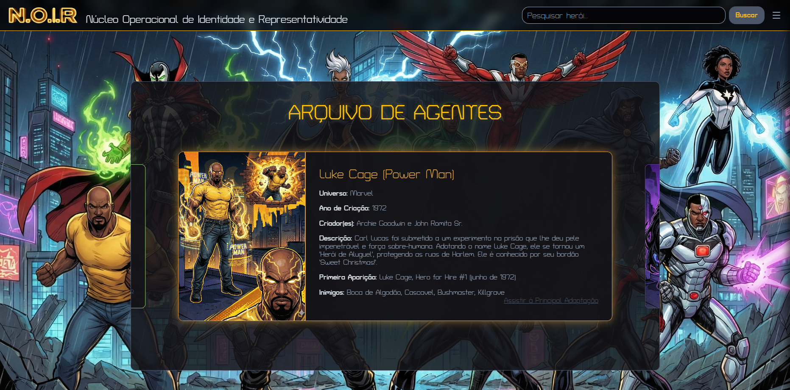

  

## Contexto e Propósito do Projeto

N.O.I.R é uma **Base de Conhecimento** desenvolvida como projeto final da **10ª Imersão Dev da Alura e Google Gemini**.

Meu objetivo é simples porém importante: garantir que cada jovem encontre aqui não apenas um personagem favorito, e sim um **reflexo de sua própria força**, mostrando a importância da representatividade no entretenimento. O projeto foi construído sobre o esqueleto do projeto apresentado da Imersão.

---
## 📸 Screenshots

  
   

    
    
    
  

## Destaques Técnicos e Funcionalidades

Este projeto foi construído visando mostrar que é possível construir uma base de conhecimento com funcionalidades avançadas e propósito, aplicando os conhecimentos adquiridos na Imersão.

- **Carrossel Infinite Loop (JS Puro):** Implementação de lógica complexa de slider com "Center Focus Mode", onde o card ativo é centralizado, ampliado e iluminado, enquanto os laterais permanecem em escala e na forma de prévia.
- **Extração Dinâmica de Cores:** Utilização da biblioteca **ColorThief** para analisar a imagem do herói e aplicar a cor predominante (variável `--hero-color`) nas bordas e no brilho do card.
- **Estética Glassmorphism:** Interface construída com CSS puro, utilizando variáveis, `backdrop-filter` e `box-shadow` para criar um visual de vidro translúcido contra o fundo escuro.
- **Busca Eficiente:** Sistema de pesquisa que filtra os dados da base `data.json` em tempo real.

### Como Usar

1.  **Navegação:** Clique em qualquer card lateral (inativo) para trazê-lo para o centro e ativar seu modo full-view.

2.  **Pesquisa:** Use a barra de busca no cabeçalho para filtrar heróis por nome.

3.  **Aproveite:** Use o link em cada card para acessar a principal adaptação audiovisual do herói nos streamings.

---

## Tecnologias Utilizadas 

    
    
    
    
    
    
    
  

| Categoria | Tecnologias |
| :--- | :--- |
| **Linguagens** | HTML5, CSS3 (Variáveis & Flexbox), JavaScript (ES6+) |
| **Dados** | JSON (Base de Conhecimento) |
| **Bibliotecas** | ColorThief, Lucide Icons |
| **Controle de Versão** | Git & GitHub |

## Minha Jornada e Ambição

Sou aluno da Alura há **pouco menos de 1 mês** e este projeto é o meu primeiro grande desenvolvimento. Fiz todas as atualizações e ajustes de funcionalidades complexas utilizando os conhecimentos da Imersão e **Vibe Coding com o Google Gemini**, que atuou como meu *pair programmer*.

Apesar de ser bastante iniciante, este projeto é o meu alicerce. O objetivo final é me tornar um desenvolvedor Full-Stack capaz de adquirir conhecimento o suficiente para desenvolver projetos muito mais complexos por conta própria.

---

## Autor & Contato

    
    
 
        <h3>Weslley Lafrata Sampaio</h3>
        
Crescimento Exponencial. Desenvolvedor iniciante com objetivo de absorver conhecimento Full-Stack o suficiente para, em breve, desenvolver projetos complexos de forma 100% autônoma. Conecte-se!

    

    

        
        

---